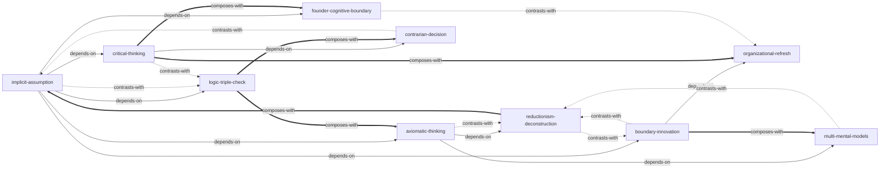

# 《第一性原理》— Skill Index

> 本书由 book2skill 蒸馏, 共产出 **10** 个 skills。
> 处理时间: 2026-04-23

## 关于这本书

- **作者**: 李善友
- **出版年**: 2021
- **一句话主旨**: 用第一性原理打破认知边界，实现破界创新
- **整书理解**: 见 [BOOK_OVERVIEW.md](./BOOK_OVERVIEW.md)

---

## Skill 列表 (按主题分组)

### 认知工具（诊断与验证）

- [`implicit-assumption`](./implicit-assumption/SKILL.md) — 隐含假设识别法：追溯推理前提，识别"默认正确"的隐含假设
- [`logic-triple-check`](./logic-triple-check/SKILL.md) — 逻辑三洽检验：用自洽/他洽/续洽三层递进框架验证信念
- [`critical-thinking`](./critical-thinking/SKILL.md) — 批判性思维框架：可证伪性+普遍怀疑+不可知论→反共识

### 创新方法（构建与破局）

- [`axiomatic-thinking`](./axiomatic-thinking/SKILL.md) — 公理化思维框架：从少数公理演绎推导完整系统
- [`boundary-innovation`](./boundary-innovation/SKILL.md) — 破界创新三部曲：破隐含假设→立新基石→见新系统
- [`reductionism-deconstruction`](./reductionism-deconstruction/SKILL.md) — 还原论拆解法：拆解到要素层面实现十倍好

### 组织与决策（应用层面）

- [`organizational-refresh`](./organizational-refresh/SKILL.md) — 组织刷新方法论：使命→文化→战略的三步刷新
- [`founder-cognitive-boundary`](./founder-cognitive-boundary/SKILL.md) — 创始人认知边界即企业边界：诊断组织发展瓶颈
- [`contrarian-decision`](./contrarian-decision/SKILL.md) — 反共识决策框架：识别共识错误并独立行动
- [`multi-mental-models`](./multi-mental-models/SKILL.md) — 多元思维模型构建法：跨学科认知工具箱

---

## 引用图



图例:
- `-->`  depends-on（前置依赖）
- `-.->` contrasts-with（对照互补）
- `===>` composes-with（组合使用）

---

## 推荐学习顺序

(从依赖图的叶子节点开始, 向上)

1. **implicit-assumption** — 最基础，没有前置；一切推理的起点是识别前提
2. **logic-triple-check** — 依赖 implicit-assumption；学会验证推理链的可靠性
3. **critical-thinking** — 依赖 implicit-assumption，与 logic-triple-check 互补；从验证工具升级为认知态度
4. **axiomatic-thinking** — 依赖 implicit-assumption；从识别前提到主动构建公理体系
5. **boundary-innovation** — 依赖 implicit-assumption；将隐含假设识别用于创新实践
6. **reductionism-deconstruction** — 依赖 axiomatic-thinking；公理化思维的具象拆解应用
7. **multi-mental-models** — 依赖 axiomatic-thinking；扩展公理体系到跨学科
8. **contrarian-decision** — 依赖 critical-thinking；将批判性思维转化为反共识行动
9. **founder-cognitive-boundary** — 依赖 implicit-assumption；将隐含假设识别应用于组织诊断
10. **organizational-refresh** — 依赖 boundary-innovation；破界创新在组织层面的系统化应用

---

## 接入 darwin-skill

所有 skill 均带有 `test-prompts.json` (darwin-skill 兼容格式), 可直接接入自动进化:

```
darwin evolve books/diyixing-yuanli/
```

---

## 审计轨迹

- 候选单元池: [candidates/](./candidates/)
- 被淘汰的候选 (含原因): [rejected/](./rejected/)
- BOOK_OVERVIEW: [BOOK_OVERVIEW.md](./BOOK_OVERVIEW.md)
